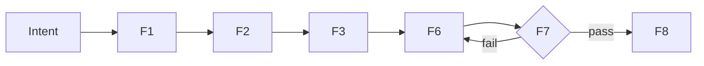

# Diagram: [NAME]

## Purpose
[WHAT this diagram does]
## Diagram Types
| Type | Syntax | Best For |
|------|--------|----------|
| Flowchart | `graph TD` | Process flow |
| Sequence | `sequenceDiagram` | API calls |
| Class | `classDiagram` | Data models |
| State | `stateDiagram-v2` | Lifecycle |
## Example

## ASCII Fallback
```
Intent -> [F1] -> [F2] -> [F3] -> [F6] -> [F7] -> [F8]
                                     ^       |fail
                                     +-------+
```
## Quality Gate
1. [ ] Diagram has title
2. [ ] Arrows are labeled
3. [ ] Both Mermaid + ASCII provided
4. [ ] Matches textual description

## Artifact Properties

| Property | Value |
|----------|-------|
| Kind | `diagram` |
| Pillar | P08 |
| Domain | system architecture |
| Pipeline | 8F (F1-F8) |
| Scorer | `cex_score.py` |
| Compiler | `cex_compile.py` |
| Retriever | `cex_retriever.py` |
| Quality target | 9.0+ |
| Density target | 0.85+ |

## Related Artifacts

| Artifact | Relationship | Score |
|----------|-------------|-------|
| [[bld_architecture_diagram]] | related | 0.49 |
| [[p01_kc_diagram]] | related | 0.48 |
| [[p11_qg_diagram]] | downstream | 0.47 |
| [[diagram-builder]] | related | 0.45 |
| [[bld_collaboration_diagram]] | downstream | 0.43 |
| [[bld_config_diagram]] | related | 0.42 |
| [[bld_instruction_diagram]] | related | 0.42 |
| [[p03_sp_diagram_builder]] | upstream | 0.34 |
| [[bld_knowledge_card_diagram]] | upstream | 0.32 |
| [[bld_tools_diagram]] | related | 0.28 |
