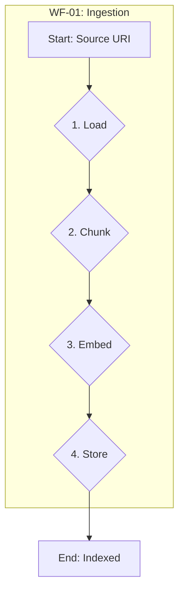
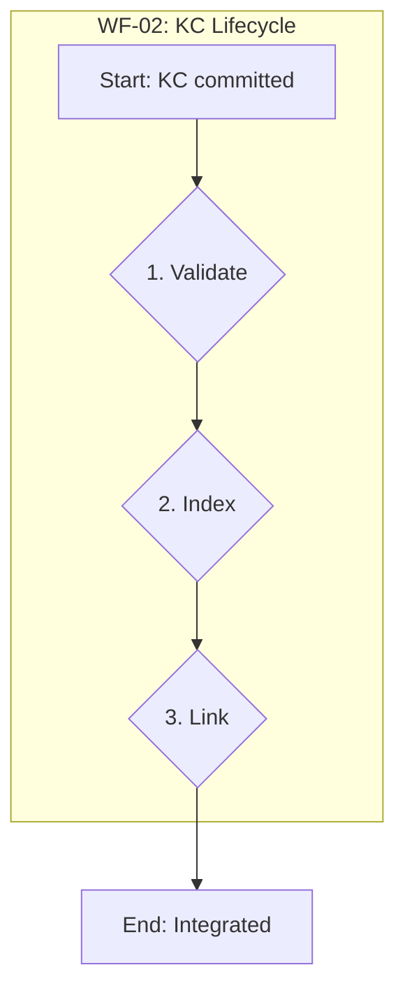
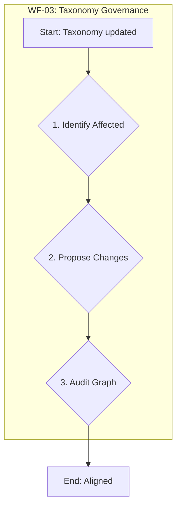

# N04 Core Knowledge Workflows

## Purpose
This document specifies the three primary, repeatable workflows orchestrated by the N04 Knowledge Nucleus. These are the core operational processes for building, integrating, and maintaining the CEX knowledge base.

---

## 1. Workflow: RAG Ingestion & Indexing
The process for adding new, unstructured information to the CEX knowledge base and making it retrievable.

- **Trigger**: A new data source is registered in `n04_rag_source_knowledge` or a manual run is initiated.
- **Goal**: To transform raw data into queryable, vectorized chunks.

| Step | Action | Description | Dependencies | Signal |
| :--- | :--- | :--- |:--- | :--- |
| **1. Load** | Use `document_loader` MCP. | Load the raw text and metadata from the source URI (e.g., git repo, URL). | `n04_rag_source_knowledge` | - |
| **2. Chunk** | Apply chunking strategy. | Segment the raw text into semantically coherent chunks based on content type. | `n04_chunk_strategy_knowledge` | - |
| **3. Embed**| Call `embedding_apis` MCP. | Generate a vector embedding for each chunk to capture its semantic meaning. | `n04_embedding_config_knowledge` | - |
| **4. Store** | Write to `vector_db` MCP. | Store chunks, embeddings, and metadata in the vector database for retrieval. | - | `indexing_complete` |

---

## 2. Workflow: Knowledge Card (KC) Lifecycle
The process for creating, validating, and integrating a canonical Knowledge Card into the CEX ecosystem.

- **Trigger**: A new Markdown file with `kind: knowledge_card` is committed.
- **Goal**: To validate, index, and link a new KC into the Knowledge Graph.

| Step | Action | Description | Dependencies | Signal |
| :--- | :--- | :--- |:--- | :--- |
| **1. Validate**| Run `cex_compile.py`. | Validate the KC's frontmatter against the `knowledge_card` schema. A failure here halts the workflow and raises an error. | `P06_schema/knowledge_card.yaml` | `error` (on fail) |
| **2. Index** | Execute WF-01. | Run the **RAG Ingestion & Indexing** workflow on the KC itself. KCs must be searchable content. | WF-01 | - |
| **3. Link** | Update graph database. | Parse the compiled KC. Add the KC as a node and its `linked_artifacts` as edges in the CEX Knowledge Graph. | - | `authoring_complete` |

---

## 3. Workflow: Taxonomy Governance
The process for maintaining the integrity of the knowledge base when the master taxonomy changes.

- **Trigger**: A commit is made to `archetypes/TAXONOMY_LAYERS.yaml`.
- **Goal**: To ensure all knowledge artifacts align with the updated taxonomy.

| Step | Action | Description | Dependencies | Signal |
| :--- | :--- | :--- |:--- | :--- |
| **1. Identify Affected**| Scan all KCs. | Scan all artifacts in the knowledge base and identify any with tags or paths that are now invalid under the new taxonomy. | `TAXONOMY_LAYERS.yaml` | - |
| **2. Propose Changes**| Create update plan. | Generate a plan of proposed changes, such as tag migrations or KC refactoring, to align artifacts with the new structure. | - | - |
| **3. Audit Graph** | Validate graph edges. | Re-validate all edges in the Knowledge Graph to ensure they still conform to the hierarchical rules of the new taxonomy. | - | `taxonomy_updated`|
