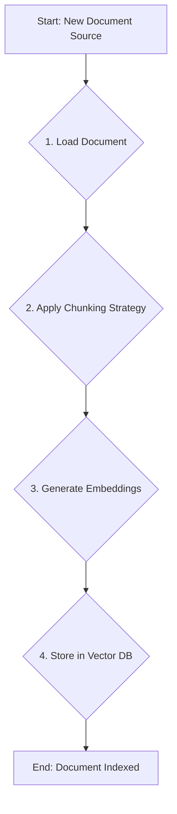
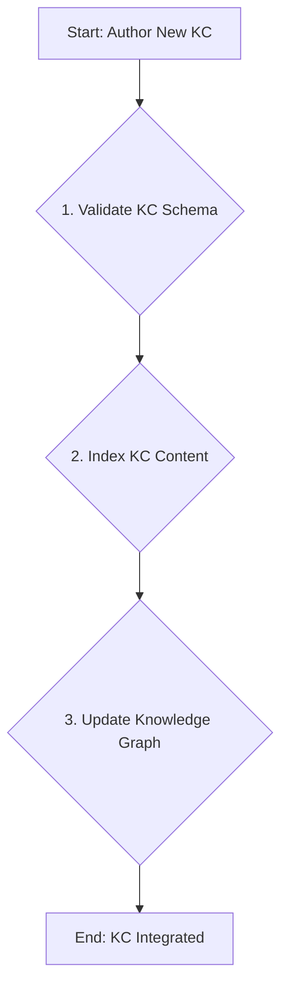

# N04 Knowledge Nucleus Workflows

## Purpose
This document outlines the three primary, repeatable workflows orchestrated by the N04 Knowledge Nucleus. These workflows represent the core operational loops for maintaining the CEX knowledge base.

---

## 1. Workflow: Document Ingestion & Indexing
This is the primary workflow for adding new, unstructured information to the knowledge base.

**Diagram:**

**Steps:**
1.  **Load Document**:
    -   **Action**: Use the appropriate `document_loader` MCP to load the raw text from a source (e.g., Markdown file, website, PDF).
    -   **Input**: Document URI.
    -   **Output**: Raw text content.
    -   **Depends on**: `n04_rag_source_knowledge` for loader configuration.
2.  **Apply Chunking Strategy**:
    -   **Action**: Segment the raw text into semantically meaningful chunks based on the rules defined in the chunking strategy artifact.
    -   **Input**: Raw text content.
    -   **Output**: A list of text chunks.
    -   **Depends on**: `n04_chunk_strategy_knowledge`.
3.  **Generate Embeddings**:
    -   **Action**: For each text chunk, call the `embedding_apis` MCP to generate a vector embedding.
    -   **Input**: A list of text chunks.
    -   **Output**: A list of vector embeddings corresponding to each chunk.
    -   **Depends on**: `n04_embedding_config_knowledge`.
4.  **Store in Vector DB**:
    -   **Action**: Store the chunks and their corresponding embeddings in the `vector_db` MCP. Include metadata (e.g., source URI, taxonomy tags).
    -   **Input**: Chunks, embeddings, and metadata.
    -   **Output**: Confirmation of successful storage.
    -   **Signal**: `indexing_complete`.

---

## 2. Workflow: Knowledge Card (KC) Authoring & Integration
This workflow describes how a canonical piece of knowledge (a KC) is created and integrated into the knowledge graph.

**Diagram:**

**Steps:**
1.  **Validate KC Schema**:
    -   **Action**: When a new KC markdown file is created, run `cex_compile.py` to validate its frontmatter against the `knowledge_card` schema.
    -   **Input**: KC markdown file path.
    -   **Output**: Success or validation error.
2.  **Index KC Content**:
    -   **Action**: Execute the **Document Ingestion & Indexing** workflow on the new KC itself. KCs are first-class citizens of the knowledge base and must be searchable.
    -   **Input**: KC markdown file path.
    -   **Output**: KC content is now searchable via semantic search.
3.  **Update Knowledge Graph**:
    -   **Action**: Parse the KC's `id` and `linked_artifacts`. Update the graph database by adding the new KC as a node and creating edges based on its links.
    -   **Input**: Compiled KC YAML data.
    -   **Output**: Updated knowledge graph.
    -   **Signal**: `authoring_complete`.

---

## 3. Workflow: Taxonomy & Graph Maintenance
This workflow is triggered when the CEX taxonomy is updated, ensuring the knowledge graph remains consistent.

**Steps:**
1.  **Detect Taxonomy Change**:
    -   **Trigger**: A change is committed to the `TAXONOMY_LAYERS.yaml` file.
2.  **Re-evaluate KC Tags**:
    -   **Action**: For each KC in the knowledge base, re-evaluate its `tags` against the new taxonomy. Suggest or apply updates where classifications have changed.
3.  **Rebuild Graph Edges**:
    -   **Action**: If taxonomy changes affect structural relationships, trigger a partial or full rebuild of the knowledge graph edges to reflect the new hierarchy.
    -   **Signal**: `taxonomy_updated`.
