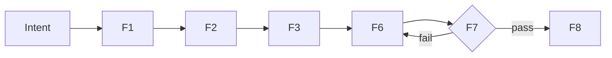

# Diagram: [NAME]

## Purpose
[WHAT this diagram does]
## Diagram Types
| Type | Syntax | Best For |
|------|--------|----------|
| Flowchart | `graph TD` | Process flow |
| Sequence | `sequenceDiagram` | API calls |
| Class | `classDiagram` | Data models |
| State | `stateDiagram-v2` | Lifecycle |
## Example

## ASCII Fallback
```
Intent -> [F1] -> [F2] -> [F3] -> [F6] -> [F7] -> [F8]
                                     ^       |fail
                                     +-------+
```
## Quality Gate
- [ ] Diagram has title
- [ ] Arrows are labeled
- [ ] Both Mermaid + ASCII provided
- [ ] Matches textual description
