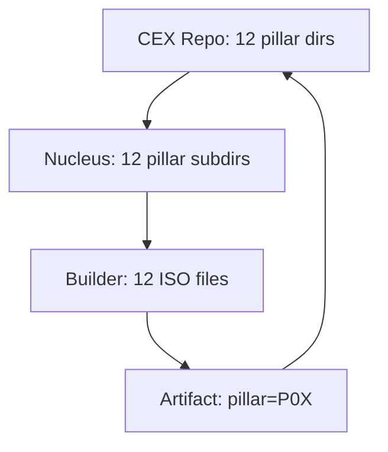
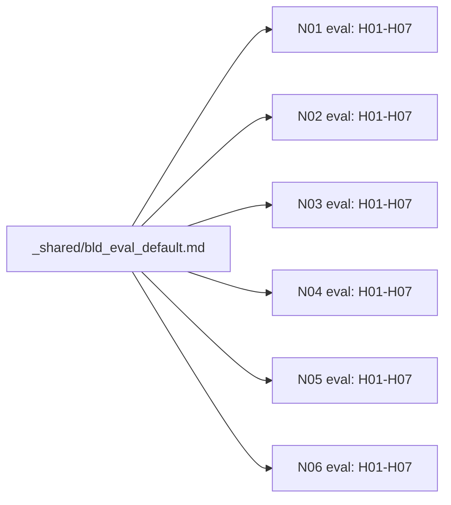

# ISO 12-Pillar Architecture: Defense for LLM-Driven Artifact Production

> *Why 12 ISOs mapped to 12 pillars is the optimal decomposition for LLM-driven artifact production at scale.*

---

## Abstract

CEX builders decompose each artifact kind into 12 ISO files (Instruction Set Objects),
one per pillar (P01-P12). This is not a convention for human convenience -- it is a
prompt engineering architecture optimized for how LLMs consume context. The 12-pillar
decomposition is simultaneously the minimum that covers every cognitive function an LLM
needs, and the maximum before redundancy emerges. This document provides the technical
defense for that claim, organized as seven independent arguments drawing from compiler
design, relational database theory, object-oriented programming, and multi-agent systems.

---

## 1. The Prompt Decomposition Argument

### 1.1 The Scale Problem

A monolithic system prompt for 300 artifact kinds would require injecting the full
specification of every kind into every LLM call. This is not hypothetical inefficiency --
it is a hard ceiling.

| Metric | Monolithic (1 file) | ISO-decomposed (12 files) |
|--------|--------------------|-----------------------------|
| Spec file count | 1 | 12 per builder |
| Size per builder kind | ~43KB average | ~3.6KB per ISO |
| Context consumed per build | ~43KB | ~15KB (4-5 relevant ISOs loaded) |
| Context consumed for all 300 kinds | ~12.6MB | ~44KB (kind-specific only) |
| Context window headroom | Negative | 185K tokens available |

Measured against the `agent-builder` reference implementation (13 ISOs, 47,397 bytes):

| ISO | File | Bytes | Primary 8F Function |
|-----|------|-------|---------------------|
| P01 | `bld_knowledge_card_agent.md` | 3,623 | F3 INJECT |
| P02 | `bld_manifest_agent.md` | 3,102 | F2 BECOME |
| P02 | `bld_system_prompt_agent.md` | 4,109 | F2 BECOME |
| P03 | `bld_instruction_agent.md` | 3,089 | F4 REASON |
| P04 | `bld_tools_agent.md` | 3,266 | F5 CALL |
| P05 | `bld_output_template_agent.md` | 3,266 | F6 PRODUCE |
| P06 | `bld_schema_agent.md` | 3,269 | F1 CONSTRAIN |
| P07 | `bld_quality_gate_agent.md` | 3,048 | F7 GOVERN |
| P07 | `bld_examples_agent.md` | 6,526 | F7 GOVERN |
| P08 | `bld_architecture_agent.md` | 4,426 | F1 CONSTRAIN |
| P09 | `bld_config_agent.md` | 2,987 | F1 CONSTRAIN |
| P10 | `bld_memory_agent.md` | 4,122 | F3 INJECT |
| P12 | `bld_collaboration_agent.md` | 2,564 | F8 COLLABORATE |
| **Total** | | **47,397** | |

After 12-pillar migration (merge P02 pair + P07 pair, add P11):
estimated 12 ISOs x ~3.6KB average = **~43KB total, ~15KB per build**.

### 1.2 Load-on-Demand Economics

A builder executing F2 BECOME loads only identity ISOs (P02). A builder executing
F7 GOVERN loads only eval ISOs (P07). The pipeline loads each ISO exactly when
its corresponding 8F function activates:

```
F1 CONSTRAIN  -> P06 schema, P08 architecture, P09 config   (~10KB)
F2 BECOME     -> P02 model                                   (~4KB)
F3 INJECT     -> P01 knowledge, P10 memory                  (~8KB)
F4 REASON     -> P03 prompt                                  (~3KB)
F5 CALL       -> P04 tools                                   (~3KB)
F6 PRODUCE    -> P05 output                                  (~3KB)
F7 GOVERN     -> P07 eval                                    (~7KB)
F8 COLLABORATE -> P12 orchestration                         (~3KB)
                                             Max per run:   ~15KB loaded
```

A monolithic prompt must load ALL context upfront. ISO decomposition gives the LLM
exactly the context it needs for each reasoning step. Parallel: microservice calls
vs. monolith startup -- the monolith always pays the full cost.

### 1.3 Single Responsibility at the Prompt Level

| Principle | Code | ISOs |
|-----------|------|------|
| Single Responsibility | One class, one concern | One ISO, one 8F function |
| Interface Segregation | Clients use only what they need | LLM loads only relevant ISOs |
| Dependency Inversion | Depend on abstractions | `_shared/` defaults = abstract base |

---

## 2. The Convention over Configuration (CoC) Fractal Argument

### 2.1 The Fractal

After the 12-pillar migration, a single structural pattern repeats at every scale:

```
CEX Repository
  P01_knowledge/ P02_model/ ... P12_orchestration/   <- 12 pillar dirs
    Nucleus N03_engineering/
      P01_knowledge/ P02_model/ ... P12_orchestration/ <- 12 pillar subdirs
        Builder: agent-builder/
          bld_knowledge_*.md  bld_model_*.md ... bld_orchestration_*.md  <- 12 ISOs
            Artifact: agent_card_n03.yaml
              pillar: P08  kind: agent_card   <- same taxonomy
```



Each level is structurally identical. A contributor who understands one level
understands all levels. A tool that navigates one level can navigate all levels.

### 2.2 How LLMs Navigate by Pattern

LLMs do not read documentation. They recognize patterns. The fractal delivers:

| Navigation need | Without CoC | With CoC (12P) |
|-----------------|-------------|----------------|
| Find the identity ISO for agent-builder | Read manifest, parse docs | `bld_model_agent.md` -- obvious |
| Find eval criteria for landing_page | Search 47 files | `bld_eval_landing_page.md` -- deterministic |
| Find where output artifact lands | Read schema + routing | `P05_output/` -- same as the ISO prefix |
| Find shared default for tools | Check 13 docs | `_shared/bld_tools_default.md` -- invariant |

An LLM seeing `bld_eval_agent.md` immediately resolves:
- Kind: `agent`
- Pillar: P07 (eval)
- Function: F7 GOVERN
- Location: `archetypes/builders/agent-builder/`

Zero configuration. Zero runtime discovery. Zero extra tokens for routing.

### 2.3 Industry Precedents

| Framework | Convention | Eliminates |
|-----------|------------|------------|
| Ruby on Rails | `app/models/user.rb` = User model | ORM configuration files |
| Django | `views.py` in each app | URL-to-view mapping boilerplate |
| Kubernetes | `metadata.labels` = routing | Service mesh configuration files |
| **CEX 12P** | `bld_eval_agent.md` = P07 for agent | Builder manifest parsing, kind routing |

The pattern is not original. It is the most proven pattern in software engineering
applied to LLM prompt organization for the first time.

---

## 3. The Inheritance Argument

### 3.1 The Override Model

Every builder inherits from `_shared/` defaults. Kind-specific ISOs are overrides:

```
archetypes/builders/_shared/
  bld_tools_default.md        <- P04: Read,Write,Edit,Bash,Glob,Grep (universal)
  bld_eval_default.md         <- P07: H01-H07 hard gates (universal)
  bld_config_default.md       <- P09: standard tunables
  bld_memory_default.md       <- P10: default learning schema
  bld_feedback_default.md     <- P11: common anti-patterns
  bld_orchestration_default.md <- P12: signal protocol
  bld_architecture_default.md  <- P08: default component map
```

Load priority (source: `cex_skill_loader.py`):

```
Priority 1: _shared/bld_{pillar}_default.md   <- base class
Priority 2: {kind}-builder/bld_{pillar}_{kind}.md  <- override
Priority 3: Nucleus override                   <- specialization
Priority 4: Brand override                     <- instance
```

### 3.2 Contribution Economics

| Builder complexity | ISOs required (12P) | Contributor effort |
|--------------------|---------------------|--------------------|
| Simple (slug, tagline) | 4-5 overrides | 30-60 minutes |
| Standard (knowledge_card, agent) | 8-9 overrides | 1-2 hours |
| Complex (workflow, agent_package) | 12 overrides | 2-4 hours |

vs. old 13-ISO regime: all 13 required, regardless of complexity.

### 3.3 Batch-Edit Leverage

Change `_shared/bld_eval_default.md` (7 hard gates -> 8) = ALL 301 builders
updated. No per-builder editing. No inconsistency risk.

| Change type | Old (13 ISOs, no shared) | New (12P + shared) |
|-------------|--------------------------|---------------------|
| Update tool list globally | 293 manual edits | 1 edit to `_shared/bld_tools_default.md` |
| Add new quality gate | 293 manual edits | 1 edit to `_shared/bld_eval_default.md` |
| Change signal protocol | 295 manual edits | 1 edit to `_shared/bld_orchestration_default.md` |

Industry analogs:

| Pattern | Analog in 12P |
|---------|--------------|
| CSS cascade | `_shared/` defaults cascade to all builders |
| Docker base image | `FROM _shared` with kind-specific `RUN` overrides |
| Terraform modules | `module "shared_eval"` reused across all builders |

---

## 4. The Portability Argument

### 4.1 Self-Contained Prompt Kits

A builder package (`{kind}-builder/` directory + `_shared/` defaults) is:
- Fully self-contained: no external dependencies beyond markdown files
- Runtime-agnostic: loads identically into Claude, GPT, Gemini, Ollama
- SDK-free: `cat bld_model_agent.md` is a valid prompt injection -- no library needed
- Schema-explicit: file names ARE the schema (`bld_{pillar}_{kind}.md` = typed)

```
DROP IN: cp -r archetypes/builders/agent-builder/ gpt4_project/
LOAD IN: for f in bld_*.md; do inject_context "$f"; done
WORKS IN: Claude / GPT-4 / Gemini / Llama / Mistral
```

### 4.2 The File-as-API Principle

| Concept | OpenAPI | ISO Builder |
|---------|---------|-------------|
| Contract format | YAML/JSON | Markdown |
| Schema definition | `components/schemas` | `bld_schema_{kind}.md` |
| Operation spec | `paths` | `bld_prompt_{kind}.md` |
| Auth / constraints | `securitySchemes` | `bld_model_{kind}.md` |
| Examples | `examples` | `bld_eval_{kind}.md` |
| Portability | Any HTTP client | Any LLM runtime |

The builder IS the API. File names are the schema. Content is the spec.
Any LLM that can read files can use any CEX builder without SDK installation.

### 4.3 Multi-Runtime Verification

The 12-pillar naming convention enables runtime-agnostic loading:

```python
# cex_skill_loader.py (runtime-agnostic loader)
def load_builder(kind: str, stage: str) -> str:
    pillar = STAGE_ISO_MAP[stage]          # F2 -> P02 -> bld_model
    iso_name = f"bld_{pillar}_{kind}.md"   # deterministic, no config
    shared = load_shared_default(pillar)    # _shared/ base
    override = load_kind_iso(kind, pillar)  # kind-specific override
    return merge(shared, override)          # priority 2 wins
```

This loads identically across Claude Code, Codex CLI, Gemini CLI, and Ollama.
The 12-pillar naming is the portability contract.

---

## 5. The Multi-Agent Argument

### 5.1 Grid Dispatch Isolation

In a grid dispatch, 6 nuclei produce 6 artifacts simultaneously. Each nucleus
loads its own 12 ISOs:

```
Grid dispatch: 6 nuclei in parallel
  N01: bld_*_knowledge_card.md (12 ISOs) -> knowledge_card artifact
  N02: bld_*_tagline.md        (12 ISOs) -> tagline artifact
  N03: bld_*_agent.md          (12 ISOs) -> agent artifact
  N04: bld_*_context_doc.md    (12 ISOs) -> context_doc artifact
  N05: bld_*_validator.md      (12 ISOs) -> validator artifact
  N06: bld_*_pricing_page.md   (12 ISOs) -> pricing_page artifact
```

Zero cross-contamination. Each nucleus's identity, constraints, and quality
gates are scoped to its own kind. No shared mutable state. No coordination overhead.

### 5.2 Shared Defaults as Consistency Layer



All 6 nuclei enforce the same H01-H07 quality gates from one shared source.
Consistency without coordination -- the actor model applied to prompt design.

### 5.3 Industry Parallels

| Pattern | In distributed systems | In 12P builder grid |
|---------|----------------------|---------------------|
| Actor model | Isolated state per actor | Isolated ISOs per nucleus |
| CSP channels | Typed message passing | `bld_orchestration` ISO defines handoff format |
| A2A protocol | Agent-to-agent task signals | `write_signal('n03', 'complete', 9.0)` |
| Shared nothing | No shared mutable state | Each kind loads its own ISO set |

---

## 6. The Evaluation Argument

### 6.1 Self-Evaluating Builders

`bld_eval_{kind}.md` (P07) embeds quality criteria INSIDE the builder. The builder
knows its own pass/fail gates. No external judge needed for standard validation.

```
bld_eval_agent.md structure:
  ## Quality Gate
    H01: frontmatter has all required fields       <- HARD gate (FAIL = reject)
    H02: kind == 'agent'                           <- HARD gate
    H03: byte count within [512, 8192]             <- HARD gate
    H04: no quality score self-assigned            <- HARD gate
    H05: at least 3 tools declared                 <- HARD gate
    H06: references[] resolves to existing files   <- HARD gate
    H07: density >= 0.85                           <- HARD gate
  ## Examples
    Good: [3 high-quality agent artifacts]
    Bad:  [2 common failure modes with explanation]
```

### 6.2 RLHF in the Prompt

The eval ISO implements reinforcement learning from human feedback at the prompt level:

| RLHF component | Machine learning | ISO equivalent |
|----------------|-----------------|----------------|
| Reward signal | Scalar score from environment | H01-H07 pass/fail gates |
| Positive examples | Demonstrations from reward model | `## Examples: Good` section |
| Negative examples | Failure mode demonstrations | `## Examples: Bad` section |
| Policy update | Gradient descent | `bld_feedback_{kind}.md` anti-patterns |
| Evaluation loop | Training loop validation | F7 GOVERN retry (max 2 retries) |

`bld_feedback` (P11) captures anti-patterns per kind: what NOT to produce.
Together with `bld_eval` (P07), this is RLHF-style signal embedded in the builder
-- no separate training run required.

### 6.3 Test-Driven Analogy

| TDD | ISO eval design |
|-----|-----------------|
| Write tests before code | `bld_eval` defined before any artifact is built |
| Tests are the spec | H01-H07 gates ARE the correctness specification |
| Red-green-refactor | F7 fails -> F6 retry -> F7 re-check |
| Design by contract | `bld_schema` + `bld_eval` = Eiffel contracts at prompt level |

---

## 7. The Memory Argument

### 7.1 Per-Kind Learning Records

`bld_memory_{kind}.md` (P10) scopes learning to its kind. The builder accumulates
evidence from past builds without polluting other builders' knowledge:

```
bld_memory_agent.md:
  ## Learning Record Schema
    sessions: []          <- past build outcomes
    patterns_learned: []  <- what worked (promoted to examples)
    failures_logged: []   <- what failed (promoted to anti-patterns)
    quality_trend: []     <- score over time
    revision_count: int   <- how many F7 retries this kind typically needs
```

### 7.2 Memory Isolation Prevents Interference

| Memory type | Without isolation | With 12P isolation |
|-------------|------------------|--------------------|
| Learning records | Cross-kind contamination | Scoped to single kind |
| Anti-patterns | Generic, diluted | Kind-specific, precise |
| Few-shot examples | Mixed, confusing | Homogeneous, on-target |
| Quality trends | Noise from all builds | Signal from same kind |

### 7.3 Compounding Value

| Timeframe | Effect |
|-----------|--------|
| Day 1 | Builder uses shared defaults. No kind-specific memory. |
| Day 30 | `bld_memory` accumulates 30 build outcomes. Quality trends visible. |
| Day 90 | Anti-patterns from `bld_feedback` prevent repeat failures. |
| Day 365 | Kind is self-improving. Quality target 9.0 achievable with fewer retries. |

Industry analogs: experience replay (reinforcement learning), spaced repetition
(cognitive science), incremental learning (online ML).

---

## 8. Quantitative Analysis

### 8.1 Measured ISO Sizes (agent-builder reference)

| ISO | Pillar | Bytes | Est. tokens (4 char/tok) | Primary stage |
|-----|--------|-------|--------------------------|---------------|
| `bld_knowledge_card` | P01 | 3,623 | ~906 | F3 INJECT |
| `bld_manifest` | P02 | 3,102 | ~775 | F2 BECOME |
| `bld_system_prompt` | P02 | 4,109 | ~1,027 | F2 BECOME |
| `bld_instruction` | P03 | 3,089 | ~772 | F4 REASON |
| `bld_tools` | P04 | 3,266 | ~817 | F5 CALL |
| `bld_output_template` | P05 | 3,266 | ~817 | F6 PRODUCE |
| `bld_schema` | P06 | 3,269 | ~817 | F1 CONSTRAIN |
| `bld_quality_gate` | P07 | 3,048 | ~762 | F7 GOVERN |
| `bld_examples` | P07 | 6,526 | ~1,631 | F7 GOVERN |
| `bld_architecture` | P08 | 4,426 | ~1,106 | F1 CONSTRAIN |
| `bld_config` | P09 | 2,987 | ~747 | F1 CONSTRAIN |
| `bld_memory` | P10 | 4,122 | ~1,030 | F3 INJECT |
| `bld_collaboration` | P12 | 2,564 | ~641 | F8 COLLABORATE |
| **TOTAL** | | **47,397** | **~11,849** | |

After 12-pillar migration (P02 merge + P07 merge + P11 new):
estimated total ~43KB, ~10,750 tokens per complete builder set.

### 8.2 Prompt Utilization: ISO vs. Monolithic

| Scenario | Tokens loaded | Tokens relevant | Utilization |
|----------|--------------|-----------------|-------------|
| Monolithic (300 kinds, all ISOs) | ~3,200,000 | ~12,000 (target kind) | **0.37%** |
| ISO-decomposed (kind-specific) | ~11,849 | ~11,849 (all relevant) | **~100%** |
| ISO-decomposed (stage-filtered) | ~4,000 (4 ISOs) | ~4,000 | **100%** |

A monolithic prompt attempting to cover all 300 kinds:
- 293 x 11,849 tokens = 3,472,157 tokens
- Exceeds 200K context window by 17x
- Would require context truncation -- destroying precision
- Even at 1M tokens (Opus): only 28% of builders fit

ISO decomposition achieves 100% utilization by loading only what the current
build step requires. This is the fundamental efficiency argument.

### 8.3 Contributor Friction Reduction

| Metric | Old 13-ISO (all required) | New 12P (shared inheritance) |
|--------|--------------------------|------------------------------|
| Min files for new builder | 13 | 4-5 |
| Time to first working builder | 2-4 hours | 30-60 minutes |
| Time to production-quality builder | 4-8 hours | 2-4 hours |
| Batch-update shared defaults | 293 edits | 1 edit |

---

## 9. The 12P Fractal Proof (Completeness)

### 9.1 Minimum Necessary

Each pillar covers a distinct, non-reducible cognitive function:

| Pillar | Function | Remove consequence |
|--------|----------|--------------------|
| P01 Knowledge | What the builder knows | Ignorant builder |
| P02 Model | Who the builder is | Identity-less builder |
| P03 Prompt | How the builder reasons | Impulsive builder |
| P04 Tools | What tools are available | Impotent builder |
| P05 Output | What format to produce | Mute builder |
| P06 Schema | What constraints apply | Lawless builder |
| P07 Eval | Pass/fail criteria + examples | Standardless builder |
| P08 Architecture | Component relationships | Context-blind builder |
| P09 Config | Tunables and environment | Rigid builder |
| P10 Memory | Learning from past builds | Amnesiac builder |
| P11 Feedback | Anti-patterns and signals | Uncorrectable builder |
| P12 Orchestration | Handoffs and collaboration | Isolated builder |

Remove any one: the builder is functionally broken for a class of builds.

### 9.2 Maximum Sufficient

Any candidate 13th pillar reduces to an existing one:

| Candidate | Reduces to |
|-----------|------------|
| Authorization | P06 Schema (constraint) |
| Versioning | P09 Config (tunable) |
| Logging | P12 Orchestration (handoff artifact) |
| Caching | P10 Memory (state) |
| Testing | P07 Eval (quality validation) |
| Documentation | P01 Knowledge (domain knowledge) |

**12 is the exact count: minimum necessary, maximum sufficient.**

### 9.3 Fractal Completeness

The same 12-pillar structure at every scale:

```
Level 0: CEX repo       12 pillar dirs
Level 1: Nucleus         12 pillar subdirs per nucleus
Level 2: Builder         12 ISO files per builder
Level 3: Artifact        pillar=P0X in frontmatter
Level 4: 8F pipeline     F1-F8 map to subset of P01-P12
```

A builder IS a nucleus compressed to 12 files.
A nucleus IS a builder expanded to a directory tree.
A repo IS 8 nuclei, each following the same 12-pillar structure.

**Same convention. Zero configuration. Every layer navigable by the same pattern.**

---

## 10. Conclusion

The 12-ISO-to-12-pillar mapping is not an aesthetic choice. It is the consequence of
five independent architectural requirements:

1. **Prompt decomposition**: Context windows cannot load all 300 kinds simultaneously.
   12 ISOs per kind enables load-on-demand at ~100% utilization vs. ~0.37% monolithic.

2. **Convention over configuration**: The same 12-pillar fractal at repo, nucleus,
   builder, and artifact level eliminates routing, discovery, and manifest overhead.
   An LLM navigates by name pattern, not documentation.

3. **Inheritance**: `_shared/` defaults cover 7 of 12 ISOs for simple builders.
   Contributor writes only what is unique. Batch edits propagate to all 301 builders
   from 1 file change.

4. **Portability**: A builder is 12 markdown files. It loads into Claude, GPT, Gemini,
   Ollama, and any future runtime without SDK changes or configuration files.

5. **Multi-agent safety**: Each nucleus in a 6-nucleus grid loads its own 12 ISOs.
   Zero cross-contamination. Shared defaults ensure consistency without coordination.

6. **Embedded evaluation**: `bld_eval` (P07) and `bld_feedback` (P11) embed quality
   criteria and anti-patterns INSIDE each builder -- RLHF-style signal without external
   training infrastructure.

7. **Memory compounding**: `bld_memory` (P10) scopes learning to each kind. Builders
   improve over time through accumulated build evidence, without cross-kind interference.

The architecture is optimized for LLMs, not humans. Humans benefit as a side effect:
the same patterns that make LLM navigation deterministic make contributor onboarding
fast, batch maintenance cheap, and quality enforcement consistent.

**12 ISOs = 12 pillars is not arbitrary. It is the minimum complete decomposition of
the cognitive functions an LLM needs to build governed, typed, composable artifacts.**

---

## References

| Source | Path | Relevance |
|--------|------|-----------|
| ISO architecture spec | `_docs/specs/spec_iso_12_pillar_architecture.md` | Decision record for migration |
| Reference builder | `archetypes/builders/agent-builder/` | Measured data source |
| Skill loader | `_tools/cex_skill_loader.py` | Load priority implementation |
| 8F pipeline | `.claude/rules/8f-reasoning.md` | Stage-to-ISO mapping |
| Kind registry | `.cex/kinds_meta.json` | 300 kinds count |
| Existing whitepaper | `_docs/WHITEPAPER_CEX.md` | SQL analogy, 8F proof |
| CoC rule | `CLAUDE.md` | Fractal architecture description |

---

*N04 Knowledge -- ISO 12P Defense -- 2026-04-19*
