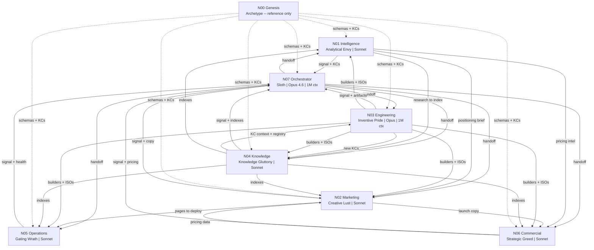
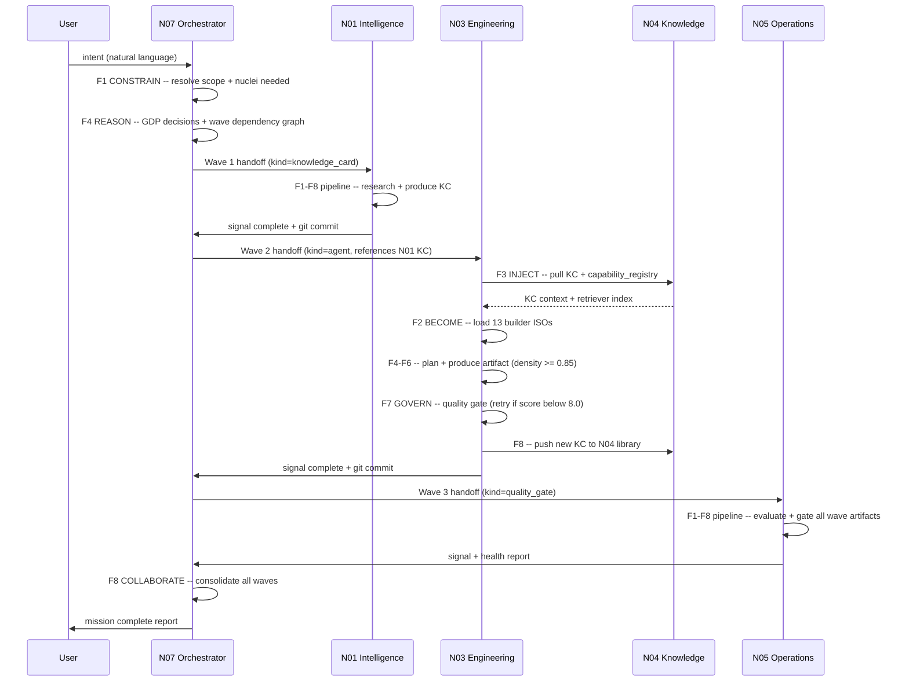
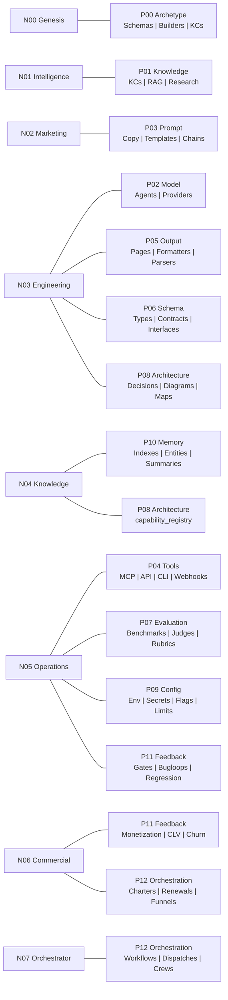

# CEX Nucleus Interconnection Map

**Date:** 2026-04-18  
**Purpose:** Authoritative reference for how CEX nuclei connect to each other -- what each nucleus owns,
produces, receives, and emits. Use this when planning crew compositions, writing handoffs, or debugging
signal flow across a multi-wave mission.

**Legend:**
- **Receives**: artifacts or signals that flow INTO a nucleus before it can act
- **Sends**: artifacts or signals that flow OUT of a nucleus on task completion
- **Pillars owned**: the P0X domains this nucleus is the canonical builder for
- **8F role**: what this specific nucleus does at each function of the universal reasoning pipeline

---

## N00 -- Genesis (Archetype)

| Property | Value |
|----------|-------|
| Role | Archetypal source of truth -- not spawnable |
| Sin Lens | n/a (pre-sin archetype) |
| Model | none (reference-only) |
| Primary Pillar | P00 |

### Pillars Owned

| Pillar | Domain | Example Kinds |
|--------|--------|---------------|
| P00 | archetype | kinds_meta, _schema, golden examples, builder ISOs |

### Kinds Produced (top 5-8)

| Kind | Pillar | Triggered By |
|------|--------|--------------|
| nucleus_def | P02 | nucleus bootstrap |
| _schema.yaml | P00 | pillar creation |
| kind_index.md | P00 | kind registration |
| knowledge_card (template) | P01 | kind onboarding |
| builder ISOs (13 per kind) | P00 | /build dispatch |

### Receives From

| Nucleus | What | When |
|---------|------|------|
| (none) | N00 does not accept runtime inputs | always static |

### Sends To

| Nucleus | What | When |
|---------|------|------|
| N01-N07 | schemas, archetypes, kinds registry, builder ISOs | every F2 BECOME load |
| N03 | builder templates (12 ISOs per kind) | every artifact construction |
| N04 | kind KCs for indexing | kind registration |

### 8F Role

| Function | What N00 provides |
|----------|------------------|
| F1 CONSTRAIN | kinds_meta.json + _schema.yaml (every nucleus reads these at F1) |
| F2 BECOME | builder ISOs (13 per kind): manifest, instruction, system prompt, etc. |
| F3 INJECT | golden examples, knowledge card templates, domain patterns |
| F4 REASON | pillar schema constraints that bound the planning surface |
| F5 CALL | builder manifest declares which tools are available per kind |
| F6 PRODUCE | output templates (tpl_*.md) ground every artifact |
| F7 GOVERN | H01-H07 gate definitions + 12LP checklist |
| F8 COLLABORATE | signal format spec + compile instructions |

---

## N01 -- Intelligence (Analytical Envy)

| Property | Value |
|----------|-------|
| Role | Research, competitive intelligence, market analysis |
| Sin Lens | Analytical Envy |
| Model | claude-sonnet-4-6 (200K) |
| Primary Pillar | P01 |

### Pillars Owned

| Pillar | Domain | Example Kinds |
|--------|--------|---------------|
| P01 | knowledge | knowledge_card, rag_source, retriever_config, embedding_config, chunk_strategy |

### Kinds Produced (top 5-8)

| Kind | Pillar | Triggered By |
|------|--------|--------------|
| knowledge_card | P01 | research request, competitor scan |
| research_pipeline | P01 | deep research intent |
| rag_source | P01 | RAG setup intent |
| dataset_card | P01 | dataset description request |
| competitive_matrix | P01 | competitor analysis intent |
| analyst_briefing | P01 | intelligence summary request |
| benchmark_suite | P07 | benchmarking research |

### Receives From

| Nucleus | What | When |
|---------|------|------|
| N07 | research handoff (.md) | before every task |
| N04 | taxonomy gaps to research | when index reveals missing KCs |
| N00 | schemas + builder ISOs | at F2 BECOME |

### Sends To

| Nucleus | What | When |
|---------|------|------|
| N02 | positioning briefs, market intel KCs | research phase complete |
| N04 | new knowledge_cards for indexing | on every KC produced |
| N06 | competitor pricing data | pricing research complete |
| N07 | completion signal (JSON) + git commit | task complete |

### 8F Role

| Function | What N01 does |
|----------|--------------|
| F1 CONSTRAIN | resolve kind=knowledge_card/research_pipeline, pillar=P01, load P01 schema |
| F2 BECOME | load research-pipeline-builder or knowledge-card-builder ISOs |
| F3 INJECT | pull existing KCs on topic, brand context, prior research |
| F4 REASON | plan: source map, 6 competitors, 3 dimensions, synthesis approach |
| F5 CALL | cex_retriever.py (find related KCs), web/paper sources |
| F6 PRODUCE | structured intelligence brief: tables > prose, sources cited |
| F7 GOVERN | validate: sources cited? density >= 0.85? no speculation? |
| F8 COLLABORATE | save to N01_intelligence/P01_knowledge/, compile, signal N07 |

---

## N02 -- Marketing (Creative Lust)

| Property | Value |
|----------|-------|
| Role | Ad copy, campaigns, taglines, landing pages, brand voice |
| Sin Lens | Creative Lust |
| Model | claude-sonnet-4-6 (200K) |
| Primary Pillar | P03 |

### Pillars Owned

| Pillar | Domain | Example Kinds |
|--------|--------|---------------|
| P03 | prompt | prompt_template, tagline, chain, action_prompt, multimodal_prompt |

### Kinds Produced (top 5-8)

| Kind | Pillar | Triggered By |
|------|--------|--------------|
| tagline | P03 | brand voice request |
| prompt_template | P03 | campaign copy brief |
| landing_page | P05 | launch intent |
| social_publisher | P04 | content calendar request |
| campaign_sprint | P12 | full campaign brief |
| press_release | P05 | product launch |
| product_tour | P05 | onboarding flow request |

### Receives From

| Nucleus | What | When |
|---------|------|------|
| N07 | campaign handoff (.md) | before every task |
| N01 | positioning briefs, market intel KCs | before copywriting |
| N06 | pricing data for copy | before launch copy |
| N00 | schemas + builder ISOs | at F2 BECOME |

### Sends To

| Nucleus | What | When |
|---------|------|------|
| N05 | landing page assets for deploy | copy finalized |
| N06 | launch copy for monetization funnels | campaign package done |
| N07 | completion signal (JSON) + git commit | task complete |

### 8F Role

| Function | What N02 does |
|----------|--------------|
| F1 CONSTRAIN | resolve kind=prompt_template/tagline/landing_page, pillar=P03/P05 |
| F2 BECOME | load prompt-template-builder or landing-page-builder ISOs |
| F3 INJECT | brand config, audience persona, past campaign KCs, tone examples |
| F4 REASON | plan: 3 ad variants (urgency/FOMO/value), A/B structure, CTA options |
| F5 CALL | brand config loaded, memory recalls past conversion data |
| F6 PRODUCE | 3 ad copy variants with hooks, CTAs, and character limits |
| F7 GOVERN | validate: brand voice match? CTA present? length within platform limits? |
| F8 COLLABORATE | save to N02_marketing/P03_prompt/, compile, signal N07 |

---

## N03 -- Engineering (Inventive Pride)

| Property | Value |
|----------|-------|
| Role | Artifact construction: agents, schemas, components, diagrams |
| Sin Lens | Inventive Pride |
| Model | claude-opus-4-6 (1M) |
| Primary Pillar | P02, P05, P06, P08 |

### Pillars Owned

| Pillar | Domain | Example Kinds |
|--------|--------|---------------|
| P02 | model | agent, agent_card, role_assignment, model_provider |
| P05 | output | output_template, formatter, diagram, parser |
| P06 | schema | input_schema, validation_schema, type_def, interface |
| P08 | architecture | component_map, decision_record, naming_rule, invariant |

### Kinds Produced (top 5-8)

| Kind | Pillar | Triggered By |
|------|--------|--------------|
| agent | P02 | "create agent" intent |
| input_schema | P06 | "validate input" intent |
| diagram | P08 | "architecture diagram" intent |
| decision_record | P08 | "record decision" intent |
| formatter | P05 | "format output as X" intent |
| component_map | P08 | "map system components" intent |
| system_prompt | P03 | system prompt authoring |

### Receives From

| Nucleus | What | When |
|---------|------|------|
| N07 | construction handoffs (.md) | before every task |
| N01 | new-kind research, domain knowledge KCs | research phase done |
| N00 | 13-ISO builder package per kind | at F2 BECOME |

### Sends To

| Nucleus | What | When |
|---------|------|------|
| N04 | kind KCs, new artifact knowledge | after every construction |
| N05 | code/artifacts to test and deploy | build complete |
| N07 | completion signal (JSON) + git commit | task complete |
| all | new builders + ISOs when a new kind is created | kind_genesis task |

### 8F Role

| Function | What N03 does |
|----------|--------------|
| F1 CONSTRAIN | resolve kind from kinds_meta.json, load pillar _schema.yaml |
| F2 BECOME | load all 12 ISOs for target kind from archetypes/builders/ |
| F3 INJECT | KC for kind, existing similar artifacts, domain examples, brand |
| F4 REASON | plan: sections, template match score, density targets, 12LP |
| F5 CALL | cex_compile.py, cex_doctor.py, cex_retriever.py for similarity |
| F6 PRODUCE | complete artifact: frontmatter + structured body (tables > prose) |
| F7 GOVERN | H01-H07 hard gates, 12LP checklist, density >= 0.85 |
| F8 COLLABORATE | save to correct pillar dir, compile, commit, signal N07 |

---

## N04 -- Knowledge (Knowledge Gluttony)

| Property | Value |
|----------|-------|
| Role | RAG setup, knowledge indexing, taxonomy, embeddings, retrieval |
| Sin Lens | Knowledge Gluttony |
| Model | claude-sonnet-4-6 (200K) |
| Primary Pillar | P10 |

### Pillars Owned

| Pillar | Domain | Example Kinds |
|--------|--------|---------------|
| P10 | memory | knowledge_index, memory_scope, entity_memory, memory_summary |
| P08 (shared) | architecture | capability_registry |

### Kinds Produced (top 5-8)

| Kind | Pillar | Triggered By |
|------|--------|--------------|
| knowledge_index | P10 | "build search index" intent |
| entity_memory | P10 | "remember this entity" intent |
| memory_scope | P10 | memory scoping request |
| capability_registry | P08 | agent discovery request |
| memory_summary | P10 | "compress memory" intent |
| glossary_entry | P01 | "define this term" intent |
| user_model | P10 | user preference tracking |

### Receives From

| Nucleus | What | When |
|---------|------|------|
| N07 | knowledge handoffs (.md) | before every task |
| N01 | research to index, new knowledge_cards | research complete |
| N03 | kind KCs, new artifact knowledge | construction complete |
| N00 | schemas + builder ISOs | at F2 BECOME |

### Sends To

| Nucleus | What | When |
|---------|------|------|
| all | capability_registry + retriever indexes | on refresh |
| N03 | kind KCs + taxonomy gaps for new builds | gap analysis done |
| N01 | taxonomy gap list for research | index audit done |
| N07 | completion signal (JSON) + git commit | task complete |

### 8F Role

| Function | What N04 does |
|----------|--------------|
| F1 CONSTRAIN | resolve kind=knowledge_index/entity_memory, pillar=P10, load schema |
| F2 BECOME | load knowledge-index-builder or entity-memory-builder ISOs |
| F3 INJECT | existing index state, KC library scan, taxonomy map, retrieval scores |
| F4 REASON | plan: chunk strategy, embedding model choice, index refresh scope |
| F5 CALL | cex_retriever.py, cex_index.py, cex_query.py for discovery |
| F6 PRODUCE | structured index artifact: kind registry + embedding config + scope |
| F7 GOVERN | validate: all kinds indexed? retrieval scores documented? completeness? |
| F8 COLLABORATE | save to N04_knowledge/P10_memory/, compile, signal N07 |

---

## N05 -- Operations (Gating Wrath)

| Property | Value |
|----------|-------|
| Role | Testing, CI/CD, quality gates, tool integrations, deployment |
| Sin Lens | Gating Wrath |
| Model | claude-sonnet-4-6 (200K) |
| Primary Pillar | P04, P07, P09, P11 |

### Pillars Owned

| Pillar | Domain | Example Kinds |
|--------|--------|---------------|
| P04 | tools | mcp_server, api_client, webhook, cli_tool, browser_tool |
| P07 | evaluation | scoring_rubric, benchmark, smoke_eval, llm_judge, trajectory_eval |
| P09 | config | env_config, secret_config, rate_limit_config, feature_flag |
| P11 | feedback | quality_gate, bugloop, regression_check, learning_record |

### Kinds Produced (top 5-8)

| Kind | Pillar | Triggered By |
|------|--------|--------------|
| quality_gate | P11 | "quality gate" intent |
| env_config | P09 | "environment config" intent |
| mcp_server | P04 | "MCP server" intent |
| smoke_eval | P07 | "smoke test" intent |
| bugloop | P11 | "auto-fix bugs" intent |
| regression_check | P11 | "check for regressions" intent |
| feature_flag | P09 | "feature toggle" intent |

### Receives From

| Nucleus | What | When |
|---------|------|------|
| N07 | operations handoffs (.md) | before every task |
| N03 | code/artifacts to test | build complete |
| N02 | landing pages to deploy | copy finalized |
| N00 | schemas + builder ISOs | at F2 BECOME |

### Sends To

| Nucleus | What | When |
|---------|------|------|
| all | quality gates + CI results | gate evaluation done |
| N07 | health reports, test verdicts | task complete |
| N07 | completion signal (JSON) + git commit | task complete |

### 8F Role

| Function | What N05 does |
|----------|--------------|
| F1 CONSTRAIN | resolve kind=quality_gate/smoke_eval, pillar=P07/P09/P11 |
| F2 BECOME | load quality-gate-builder or env-config-builder ISOs |
| F3 INJECT | existing test results, CI config, artifact quality history |
| F4 REASON | plan: gate thresholds, test scope, regression baseline |
| F5 CALL | cex_doctor.py, cex_system_test.py, cex_hooks.py for validation |
| F6 PRODUCE | quality gate spec or CI config with pass/fail criteria |
| F7 GOVERN | validate: all gates pass? thresholds justified? no regressions? |
| F8 COLLABORATE | save to N05_operations/, compile, commit, signal N07 |

---

## N06 -- Commercial (Strategic Greed)

| Property | Value |
|----------|-------|
| Role | Pricing, courses, funnels, CLV, monetization strategy |
| Sin Lens | Strategic Greed |
| Model | claude-sonnet-4-6 (200K) |
| Primary Pillar | P11 (shared), P12 (shared) |

### Pillars Owned

| Pillar | Domain | Example Kinds |
|--------|--------|---------------|
| P11 (shared) | feedback | content_monetization |
| P12 (shared) | orchestration | team_charter |

### Kinds Produced (top 5-8)

| Kind | Pillar | Triggered By |
|------|--------|--------------|
| content_monetization | P11 | "pricing strategy" intent |
| subscription_tier | P11 | "subscription tiers" intent |
| team_charter | P12 | "mission contract" intent |
| course_module | P05 | "course outline" intent |
| roi_calculator | P05 | "ROI model" intent |
| churn_prevention_playbook | P12 | "reduce churn" intent |
| pricing_page | P05 | "pricing page" intent |

### Receives From

| Nucleus | What | When |
|---------|------|------|
| N07 | commercial handoffs (.md) | before every task |
| N01 | competitor pricing data | pricing research complete |
| N02 | launch copy | campaign package done |
| N00 | schemas + builder ISOs | at F2 BECOME |

### Sends To

| Nucleus | What | When |
|---------|------|------|
| N02 | pricing data for copy | tier model finalized |
| N07 | charter gate outcomes | mission contract signed |
| N07 | completion signal (JSON) + git commit | task complete |

### 8F Role

| Function | What N06 does |
|----------|--------------|
| F1 CONSTRAIN | resolve kind=content_monetization/subscription_tier, pillar=P11 |
| F2 BECOME | load content-monetization-builder or subscription-tier-builder ISOs |
| F3 INJECT | competitor pricing KC, market segments, customer CLV data, brand |
| F4 REASON | plan: 3 tiers (free/pro/enterprise), feature gating, annual discount |
| F5 CALL | cex_retriever.py finds existing monetization artifacts, brand config |
| F6 PRODUCE | pricing model: tier table + feature matrix + revenue projections |
| F7 GOVERN | validate: tiers differentiated? no cannibalization? margins positive? |
| F8 COLLABORATE | save to N06_commercial/, compile, commit, signal N07 |

---

## N07 -- Admin (Orchestrating Sloth)

| Property | Value |
|----------|-------|
| Role | Orchestrator: dispatch, mission planning, wave management, consolidation |
| Sin Lens | Orchestrating Sloth |
| Model | claude-opus-4-6 (1M) |
| Primary Pillar | P12 |

### Pillars Owned

| Pillar | Domain | Example Kinds |
|--------|--------|---------------|
| P12 | orchestration | workflow, dispatch_rule, schedule, crew_template |

### Kinds Produced (top 5-8)

| Kind | Pillar | Triggered By |
|------|--------|--------------|
| workflow | P12 | "workflow" intent |
| dispatch_rule | P12 | routing configuration |
| schedule | P12 | "schedule a task" intent |
| crew_template | P12 | "assemble crew" intent |
| handoff | P12 | every nucleus dispatch |
| mission_plan | P12 | "/mission" or "/plan" |
| decision_record | P08 | GDP decision finalization |

### Receives From

| Nucleus | What | When |
|---------|------|------|
| all | completion signals (JSON) | after every nucleus task |
| all | git commits (quality-attested artifacts) | after every nucleus task |
| N05 | health reports, test verdicts | wave completion |
| N06 | charter gate outcomes | mission contract evaluation |
| user | goal, GDP decisions | at session start or /mission |

### Sends To

| Nucleus | What | When |
|---------|------|------|
| all | handoffs (.md) + crew charters | before dispatch |
| all | decision_manifest.yaml | after GDP |
| user | reports, GDP prompts, final artifact summary | at consolidation |
| N07 | (self) archive signals, update memory | post-consolidation |

### 8F Role

| Function | What N07 does |
|----------|--------------|
| F1 CONSTRAIN | scope mission: nuclei needed, wave structure, budget |
| F2 BECOME | Orchestrating Sloth: ruthless quality, precise dispatch, minimal own work |
| F3 INJECT | mission plans, decision manifest, signal history, past wave outcomes |
| F4 REASON | plan: 3 waves, 5 nuclei, dependency graph, GDP if subjective |
| F5 CALL | provider discovery, agent spawn validation, PID tracking |
| F6 PRODUCE | handoffs + mission plan + wave schedule (writes .md files, not artifacts) |
| F7 GOVERN | validate: handoffs have frontmatter? nuclei have boot scripts? manifest present? |
| F8 COLLABORATE | dispatch grid, monitor signals, consolidate on completion |

---

## Master Connection Matrix

Cells show primary artifact flow direction. `-` = same nucleus. `->` = sends to.
`<-` = receives from. `<>` = bidirectional exchange.

|     | N00 | N01 | N02 | N03 | N04 | N05 | N06 | N07 |
|-----|-----|-----|-----|-----|-----|-----|-----|-----|
| N00 | -   | ->  | ->  | ->  | ->  | ->  | ->  | ->  |
| N01 | <-  | -   | ->  | <-  | <>  | <-  | ->  | <>  |
| N02 | <-  | <-  | -   | <-  | <-  | ->  | <>  | <>  |
| N03 | <-  | <-  | <-  | -   | ->  | ->  | <-  | <>  |
| N04 | <-  | <>  | <-  | <>  | -   | <-  | <-  | <>  |
| N05 | <-  | ->  | <-  | <-  | ->  | -   | <-  | <>  |
| N06 | <-  | <-  | <>  | ->  | ->  | ->  | -   | <>  |
| N07 | <-  | <>  | <>  | <>  | <>  | <>  | <>  | -   |

**Legend:** `->` sends artifacts/signals | `<-` receives from | `<>` bidirectional | `-` self

### Key Flows (most critical paths)

| Path | What flows | Trigger |
|------|-----------|---------|
| N00 -> all | schemas, ISOs, examples | every F2 BECOME |
| N07 -> all | handoffs, decision manifest | every dispatch |
| all -> N07 | completion signals | every task end |
| N01 -> N04 | knowledge_cards to index | research complete |
| N03 -> N04 | kind KCs | construction complete |
| N01 -> N02 | positioning briefs | before campaign copy |
| N02 -> N05 | landing pages to deploy | copy finalized |
| N05 -> all | quality gates | CI/CD pipeline |
| N06 -> N02 | pricing data | tier model finalized |
| N04 -> all | capability_registry | on refresh |

---

## Visual Diagrams

> Produced by N03 Engineering. Mermaid-rendered in GitHub, Notion, and any Markdown previewer.

### Diagram 1 -- Nucleus Topology (Full System)

### Diagram 2 -- 8F Pipeline Flow Across Nuclei (Mission Sequence)

### Diagram 3 -- Pillar Ownership Map

